# Fixed-Space Prime Compatibility

Alexander Eastwood's complete working manuscript, **v1.39**.

**G2 and the Riemann Hypothesis remain open.** Nothing in this repository
claims otherwise.

## Navigating this repository

- **[RESEARCH_MAP.md](RESEARCH_MAP.md)** — the whole project as one diagram:
  every idea, which sub-ideas were tried, and which passed or failed.
- **[COMPARISON.md](COMPARISON.md)** — where the certified `lambda = 4`
  window sits relative to published work, with the parameter translation.
- **[REPO_LAYOUT.md](REPO_LAYOUT.md)** — directory layout, branch and tag
  conventions, and how to add a new version.
- **[evidence/MISSING.md](evidence/MISSING.md)** — artifacts the manuscript
  cites that this repository does not yet contain. Read this before relying
  on any computer-assisted claim.
- **[AGENTS.md](AGENTS.md)** — instructions for AI agents contributing here.

```sh
./manuscript/build.sh                     # build the PDF (source validation is not a build)
python3 tools/verify_manifest.py v126     # check a version's artifacts, or --all
python3 tools/make_map.py                 # regenerate RESEARCH_MAP.md
```

## Status at a glance

| | |
|---|---|
| Only positivity result | `W_4 >= 0`, both parity sectors — evidence restored and verified |
| Finite floors | `W_λ >= -8·I` at λ = 5, 6, 8, both parities, full infinite tail (`prop:v138-three-floors`) |
| Certified window | half-width `a = log 4 = 1.386`; 1.73× the published Zhu window, 4× the classical range |
| Live mechanism | signed weighted concentration, even sector (`prop:v131-concentration`) |
| Routes proved closed | 10 |
| Evidence gaps | 2 of 4 tracked groups open — see the ledger |
| G2 | open |
| RH | open, and not claimed |

## Research map

Every idea, which sub-ideas were tried from it, and which passed or failed.
Green = proved · blue = live · red = closed · orange = blocked · grey = open.
Nodes with a folder icon link to the `evidence/` directory holding their
certificates; the full version with a node-by-node list is
[RESEARCH_MAP.md](RESEARCH_MAP.md).

```mermaid
graph LR
  rh["RH"]
  g1["G1 (weak)<br/><small>thm:v14-radical</small><br/><small>&#128193; evidence/v124/g2_source_certificate</small>"]
  fixedspace["Fixed-space / Burnol Sonine route"]
  g2["G2: cofinal -o(1)<br/><small>prop:v121-cofinal-rh</small>"]
  windows["Fixed-window certificates"]
  w3["lambda=3<br/><small>prop:v116-window-positive</small><br/><small>&#128193; evidence/v124/g2_certificate</small>"]
  w4e["lambda=4 even<br/><small>prop:v125-even-complete</small><br/><small>&#128193; evidence/v126</small>"]
  w4o["lambda=4 odd<br/><small>prop:v126-odd-complement</small><br/><small>&#128193; evidence/v126</small>"]
  w4["W_4 >= 0 both sectors<br/><small>prop:v126-full-window</small><br/><small>&#128193; evidence/v126</small>"]
  w5["lambda=5"]
  uniform["Uniform mechanism for G2"]
  primenorm["unsigned prime-norm domination<br/><small>prop:v119-prime-essential</small><br/><small>&#128193; evidence/v124/g2_growing_sign</small>"]
  normcontr["norm contraction<br/><small>prop:v120-norm-counterexample</small><br/><small>&#128193; evidence/v124/g2_weighted_signed</small>"]
  schatten["Schatten / Hilbert-Schmidt<br/><small>prop:v132-schatten</small><br/><small>EVIDENCE MISSING</small>"]
  sampling["basis / sampling dominance<br/><small>prop:v121-complement-cancellation</small><br/><small>&#128193; evidence/v124/g2_schur_cancellation</small>"]
  farmaj["scalar far majorant<br/><small>prop:v125-cutoff-cost</small><br/><small>&#128193; evidence/v126/g2_window_resolution</small>"]
  blockmetric["block metrics<br/><small>EVIDENCE MISSING</small>"]
  flattop["flat-top smoothing<br/><small>prop:v132-flat-top</small><br/><small>EVIDENCE MISSING</small>"]
  recipband["reciprocal-band commutation<br/><small>EVIDENCE MISSING</small>"]
  cotlar["Cotlar cross terms / atomization<br/><small>EVIDENCE MISSING</small>"]
  scalarprim["scalar signed primitive<br/><small>cor:v137-scalar-no-go</small><br/><small>&#128193; evidence/v137</small>"]
  concentration["signed weighted concentration<br/><small>prop:v131-concentration</small><br/><small>EVIDENCE MISSING</small>"]
  weaken["Target weakening"]
  floor["uniform finite floor suffices<br/><small>prop:v136-bounded-floor</small><br/><small>&#128193; evidence/v136</small>"]
  gapfree["no uniform positive gap exists<br/><small>prop:v135-growing-radical</small><br/><small>&#128193; evidence/v135</small>"]
  floortest["W_lambda >= -8 I at lambda=5,6,8<br/><small>prop:v138-three-floors</small><br/><small>&#128193; evidence/v138</small>"]
  shiftbarrier["bounded shift keeps the exp cutoff barrier<br/><small>prop:v138-shifted-floor</small><br/><small>&#128193; evidence/v138</small>"]
  metablind["Scoped information-loss obstructions<br/><small>thm:v139-probe-relaxation; thm:v139-protected-orbit</small><br/><small>&#128193; evidence/v139</small>"]
  altroutes["Alternative criteria (all equivalent; same wall)"]
  circle["circle / Toeplitz-Hankel lens<br/><small>&#128193; evidence/diag_circle_split</small>"]
  debranges["de Branges / Hermite-Biehler"]
  f1["function field / Hodge / F_1"]
  nb["Nyman-Beurling-Baez-Duarte<br/><small>&#128193; evidence/diag_routes/nb</small>"]
  li["Li / Keiper coefficients<br/><small>&#128193; evidence/diag_routes/li</small>"]
  dbn["de Bruijn-Newman (0 <= Lambda <= 0.22)<br/><small>&#128193; evidence/diag_routes/dbn</small>"]
  ccmmu["W_4 >= 0  <=>  CCM mu_lambda >= 0 for all lambda <= 4"]
  simpleeven4["simple even ground of complete W_4 (proposed certificate)"]

  rh --> g1
  rh --> fixedspace
  rh --> g2
  g2 --> windows
  windows --> w3
  windows --> w4e
  windows --> w4o
  windows --> w4
  windows --> w5
  g2 --> uniform
  uniform --> primenorm
  uniform --> normcontr
  uniform --> schatten
  uniform --> sampling
  uniform --> farmaj
  uniform --> blockmetric
  uniform --> flattop
  uniform --> recipband
  uniform --> cotlar
  uniform --> scalarprim
  uniform --> concentration
  g2 --> weaken
  weaken --> floor
  weaken --> gapfree
  floor --> floortest
  floor --> shiftbarrier
  uniform --> metablind
  rh --> altroutes
  altroutes --> circle
  altroutes --> debranges
  altroutes --> f1
  altroutes --> nb
  altroutes --> li
  altroutes --> dbn
  w4 --> ccmmu
  w4 --> simpleeven4

  click g1 "evidence/v124/g2_source_certificate/" "evidence: evidence/v124/g2_source_certificate"
  click w3 "evidence/v124/g2_certificate/" "evidence: evidence/v124/g2_certificate"
  click w4e "evidence/v126/" "evidence: evidence/v126"
  click w4o "evidence/v126/" "evidence: evidence/v126"
  click w4 "evidence/v126/" "evidence: evidence/v126"
  click primenorm "evidence/v124/g2_growing_sign/" "evidence: evidence/v124/g2_growing_sign"
  click normcontr "evidence/v124/g2_weighted_signed/" "evidence: evidence/v124/g2_weighted_signed"
  click sampling "evidence/v124/g2_schur_cancellation/" "evidence: evidence/v124/g2_schur_cancellation"
  click farmaj "evidence/v126/g2_window_resolution/" "evidence: evidence/v126/g2_window_resolution"
  click scalarprim "evidence/v137/" "evidence: evidence/v137"
  click floor "evidence/v136/" "evidence: evidence/v136"
  click gapfree "evidence/v135/" "evidence: evidence/v135"
  click floortest "evidence/v138/" "evidence: evidence/v138"
  click shiftbarrier "evidence/v138/" "evidence: evidence/v138"
  click metablind "evidence/v139/" "evidence: evidence/v139"
  click circle "evidence/diag_circle_split/" "evidence: evidence/diag_circle_split"
  click nb "evidence/diag_routes/nb/" "evidence: evidence/diag_routes/nb"
  click li "evidence/diag_routes/li/" "evidence: evidence/diag_routes/li"
  click dbn "evidence/diag_routes/dbn/" "evidence: evidence/diag_routes/dbn"

  classDef proved fill:#a5d6a7,stroke:#1b5e20,color:#000;
  class g1,windows,w3,w4e,w4o,w4,weaken,floor,gapfree,floortest,shiftbarrier,metablind,ccmmu proved;
  classDef live fill:#90caf9,stroke:#0d47a1,color:#000;
  class concentration,circle live;
  classDef closed fill:#ef9a9a,stroke:#b71c1c,color:#000;
  class primenorm,normcontr,schatten,sampling,farmaj,blockmetric,flattop,recipband,cotlar,scalarprim,debranges,f1,nb,li,dbn closed;
  classDef blocked fill:#ffcc80,stroke:#e65100,color:#000;
  class w5 blocked;
  classDef open fill:#cfd8dc,stroke:#37474f,color:#000;
  class rh,fixedspace,g2,uniform,altroutes,simpleeven4 open;
```

<!-- research-map:start -->

<!-- research-map:end -->

## Current manuscript

- [Complete LaTeX](manuscript/fixed_space_prime_action_v1.tex)
- [Research log and candidate register](log/RH_G1_G2_research_log.md)
- [Revision notes](log/v1_revision_notes.md)
- [Checksums and provenance](manifest/v1.39_manifest.json)

One live manuscript; delivery is **LaTeX only** at the author's request.
Prior versions are reachable by tag (`v1.24`, `v1.34` … `v1.38`).

## New in v1.39

Two precise meta-obstructions delimit information-losing estimates. The
optimal full-histogram mass-cap bound, and a mass/height/variation
relaxation, cannot supply a cofinal finite floor for the actual symbol.
A separate spectral-rotation theorem preserves any finite head and its
complete operator action while exposing the divergent negative multiplier
edge. Its conjugates need not remain multiplication operators.

The unrestricted slogan “every location-insensitive estimate fails” is
false; an exact positive counterexample and a ten-route coverage audit
are included. These results do not close G2 or prove RH.

[Proof, exact checks and scope audit](evidence/v139/).

## New in v1.38

v1.36 reduced G2 to a **uniform finite floor**: one constant `C_*` with
`W_λ >= -C_*·I` along a cofinal family suffices, with no decay required.
v1.38 tests that reduction directly instead of seeking another positivity
certificate.

With a common shift `δ = 8`, head cutoff `N = 256`, remote cutoff
`J = 4096`, moment order 16, and **no tail-metric prerequisite** (`Z = 0`),
both complete parity forms are certified at λ = 5, 6, 8:

    -8  <=  inf σ(W_λ^±)  <  1e-16

The lower bound retains the complete infinite Fourier tail; the upper
bound is a certified finite-support trial quotient. By support
consistency the floor holds for every `1 < λ <= 8`. The same exact dyadic
witnesses pass at 160 and 256 bits.

The shift is what makes it affordable: the remote cutoff needs
`N+1 > L·exp(M_φ − δ)`, so `δ = 8` buys a factor `e^8`. But
`prop:v138-shifted-floor` proves any *bounded* shift keeps the exponential
barrier of `prop:v125-cutoff-cost`; escaping it in this comparison would
need `δ` to grow like `M_φ ~ λ`, which is uninformative. The certificate's
generalized margin falls from 0.84 to 0.10 (odd) across the three windows.
**That decrease measures enclosure headroom, not the sign of the physical
edge** — no cofinal lower estimate is asserted, and no G2 gap is closed.

- [certificates, 160 and 256 bits](evidence/v138/)

## New in v1.37

v1.36 showed that one uniform finite ordinary lower floor on the complete
small-residual complement would suffice. v1.37 tests whether the older
scalar primitive estimate could meet this weaker target.

It cannot: for the exact arithmetic symbol, its optimal scalar error
`a Delta(beta_a)` tends to infinity. The pointwise infimum of `beta_a`
also tends to minus infinity. Both conclusions are unconditional.

The proof uses a nonnegative frequency probe whose Fourier transform
vanishes at the two physical cutoff endpoints. Under RH its pairing with
the exact symbol retains a negative cutoff side lobe around a zero.
Any bounded cofinal scalar certificate would itself imply RH via v1.36,
then contradict that pairing. The linear rates are RH-conditional; no
unconditional linear rate is asserted.

The probe is not a physical squared Paley–Wiener transform, so these scalar
obstructions do not refute positivity of the physical form. The signed
concentration estimate, retaining favorable and unfavorable levels jointly,
remains open in both parities. No G2 sign gap was closed.

- [Proof and novelty report](evidence/v137/research_report.md)
- [Proof excerpt](evidence/v137/new_section.tex)
- [Independent adversarial review](evidence/v137/adversarial_review.md)
- [Probe checks](evidence/v137/check_probe.py) · [results](evidence/v137/probe_results.json)

The ingredients are classical; worldwide novelty is not claimed. Numerical
quadrature is diagnostic and not a proof.

## The `lambda = 4` evidence

The original v1.26 reproduction bundle has been recovered and committed
under [`evidence/v126/`](evidence/v126/): 468 files, byte-identical to the
archived ZIP (SHA-256 `ccdb8eaa…82d8f`, independently re-verified). It
includes both final certificate directories:

- [complete even sector — `g2_simultaneous`](evidence/v126/g2_simultaneous/)
- [complete odd sector — `g2_odd_complement`](evidence/v126/g2_odd_complement/)

Final proof gates using the saved ingredients, witness bindings and the
exact shared-head equality were replayed successfully. This did not
regenerate witnesses or rerun every residual assembly; RESTORED in the
ledger records availability, not a fresh independent audit of every
computation. Provenance and per-file checksums:
[`manifest/README_v126_evidence_recovery.md`](manifest/README_v126_evidence_recovery.md).

## License

Apache-2.0 — see [LICENSE](LICENSE).
