# Fixed-Space Prime Compatibility

Alexander Eastwood's complete working manuscript, **v1.47**.

**G2 and the Riemann Hypothesis remain open.** Nothing in this repository
claims otherwise.

## Navigating this repository

- **[RESEARCH_MAP.md](RESEARCH_MAP.md)** — the whole project as one diagram:
  every idea, which sub-ideas were tried, and which passed or failed.
- **[COMPARISON.md](COMPARISON.md)** — where the certified `lambda = 4`
  window sits relative to published work, with the parameter translation.
- **[REPO_LAYOUT.md](REPO_LAYOUT.md)** — directory layout, branch and tag
  conventions, and how to add a new version.
- **[evidence/MISSING.md](evidence/MISSING.md)** — artifacts the manuscript
  cites that this repository does not yet contain. Read this before relying
  on any computer-assisted claim.
- **[AGENTS.md](AGENTS.md)** — instructions for AI agents contributing here.

```sh
./manuscript/build.sh                     # build the PDF (source validation is not a build)
python3 tools/verify_manifest.py v126     # check a version's artifacts, or --all
python3 tools/make_map.py                 # regenerate RESEARCH_MAP.md
```

## Status at a glance

| | |
|---|---|
| Only positivity result | `W_4 >= 0`, both parity sectors — evidence restored and verified |
| Complete ground at lambda=4 | Simple and even; `0<mu0<2.454e-75`, `mu1>1e-73`; its entire Fourier transform has only real zeros ([certificate](evidence/v140/)) |
| Complete-ground first zero | First positive zero simple and within 8.752082e-33 of gamma_1, at 1024/1280 bits ([v1.43](evidence/v143/)); no discrepancy sign |
| CCM finite benchmark | Eight local lambda=3, N=120 root discrepancies certified at 768/1024 bits; broader reproduction remains diagnostic ([v1.41](evidence/v141/)) |
| Finite floors | `W_λ >= -8·I` at λ = 5, 6, 8, both parities, full infinite tail (`prop:v138-three-floors`) |
| Certified window | half-width `a = log 4 = 1.386`; 1.73× the published Zhu window, 4× the classical range |
| Live mechanism | signed weighted concentration, even sector (`prop:v131-concentration`) |
| Routes proved closed | 10 |
| Evidence gaps | 2 of 4 tracked groups open — see the ledger |
| G2 | open |
| RH | open, and not claimed |

## Research map

Every idea, which sub-ideas were tried from it, and which passed or failed.
Green = proved · gold = current route · red = closed · purple = blocked · grey = open.
Nodes with a folder icon link to the `evidence/` directory holding their
certificates; the full version with a node-by-node list is
[RESEARCH_MAP.md](RESEARCH_MAP.md).

```mermaid
graph LR
  rh["RH"]
  g1["G1 (weak)<br/><small>thm:v14-radical</small><br/><small>&#128193; evidence/v124/g2_source_certificate</small>"]
  fixedspace["Fixed-space / Burnol Sonine route"]
  g2["G2: cofinal -o(1)<br/><small>prop:v121-cofinal-rh</small>"]
  windows["Fixed-window certificates"]
  w3["lambda=3<br/><small>prop:v116-window-positive</small><br/><small>&#128193; evidence/v124/g2_certificate</small>"]
  w4e["lambda=4 even<br/><small>prop:v125-even-complete</small><br/><small>&#128193; evidence/v126</small>"]
  w4o["lambda=4 odd<br/><small>prop:v126-odd-complement</small><br/><small>&#128193; evidence/v126</small>"]
  w4["W_4 >= 0 both sectors<br/><small>prop:v126-full-window</small><br/><small>&#128193; evidence/v126</small>"]
  w5["lambda=5"]
  uniform["Uniform mechanism for G2"]
  primenorm["unsigned prime-norm domination<br/><small>prop:v119-prime-essential</small><br/><small>&#128193; evidence/v124/g2_growing_sign</small>"]
  normcontr["norm contraction<br/><small>prop:v120-norm-counterexample</small><br/><small>&#128193; evidence/v124/g2_weighted_signed</small>"]
  schatten["Schatten / Hilbert-Schmidt<br/><small>prop:v132-schatten</small><br/><small>EVIDENCE MISSING</small>"]
  sampling["basis / sampling dominance<br/><small>prop:v121-complement-cancellation</small><br/><small>&#128193; evidence/v124/g2_schur_cancellation</small>"]
  farmaj["scalar far majorant<br/><small>prop:v125-cutoff-cost</small><br/><small>&#128193; evidence/v126/g2_window_resolution</small>"]
  blockmetric["block metrics<br/><small>EVIDENCE MISSING</small>"]
  flattop["flat-top smoothing<br/><small>prop:v132-flat-top</small><br/><small>EVIDENCE MISSING</small>"]
  recipband["reciprocal-band commutation<br/><small>EVIDENCE MISSING</small>"]
  cotlar["Cotlar cross terms / atomization<br/><small>EVIDENCE MISSING</small>"]
  scalarprim["scalar signed primitive<br/><small>cor:v137-scalar-no-go</small><br/><small>&#128193; evidence/v137</small>"]
  concentration["signed weighted concentration<br/><small>prop:v131-concentration</small><br/><small>&#128193; evidence/v146</small>"]
  weaken["Target weakening"]
  floor["uniform finite floor suffices<br/><small>prop:v136-bounded-floor</small><br/><small>&#128193; evidence/v136</small>"]
  gapfree["no uniform positive gap exists<br/><small>prop:v135-growing-radical</small><br/><small>&#128193; evidence/v135</small>"]
  floortest["W_lambda >= -8 I at lambda=5,6,8<br/><small>prop:v138-three-floors</small><br/><small>&#128193; evidence/v138</small>"]
  shiftbarrier["bounded shift keeps the exp cutoff barrier<br/><small>prop:v138-shifted-floor</small><br/><small>&#128193; evidence/v138</small>"]
  metablind["Scoped information-loss obstructions<br/><small>thm:v139-probe-relaxation; thm:v139-protected-orbit</small><br/><small>&#128193; evidence/v139</small>"]
  altroutes["Alternative criteria (all equivalent; same wall)"]
  circle["circle / Toeplitz-Hankel lens<br/><small>&#128193; evidence/diag_true_symbol</small>"]
  debranges["de Branges / Hermite-Biehler"]
  f1["function field / Hodge / F_1"]
  nb["Nyman-Beurling-Baez-Duarte<br/><small>&#128193; evidence/diag_routes/nb</small>"]
  li["Li / Keiper coefficients<br/><small>&#128193; evidence/diag_routes/li</small>"]
  dbn["de Bruijn-Newman (0 <= Lambda <= 0.22)<br/><small>&#128193; evidence/diag_routes/dbn</small>"]
  ccmmu["W_4 >= 0  <=>  CCM mu_lambda >= 0 for all lambda <= 4"]
  simpleeven4["complete W_4: simple even ground; real-zero transform<br/><small>prop:v140-ground4; cor:v140-real-zeros</small><br/><small>&#128193; evidence/v140</small>"]
  stepb["CCM step (b): finite-compression zeros track zeta zeros (numerical)<br/><small>&#128193; evidence/diag_ns2_semantic_lock</small>"]
  semanticlock["CCM finite-compression semantic lock, lambda=3 N=120<br/><small>lem:v141-centering; prop:v141-ccm-lock</small><br/><small>&#128193; evidence/v141</small>"]
  groundzero4["complete ground zero within 0.1 of gamma_1<br/><small>lem:v142-energy-projection; prop:v142-ground-zero</small><br/><small>&#128193; evidence/v142</small>"]
  groundzero4resolution["first complete zero within 9e-33; archived resolution quantified<br/><small>prop:v143-first-zero-bound; prop:v143-resolution; prop:v143-fixed-window-meaning</small><br/><small>&#128193; evidence/v143</small>"]
  pencilconcentration["pencil loss budget; cofinal obligation retained<br/><small>prop:v144-pencil-concentration</small><br/><small>&#128193; evidence/v144</small>"]
  betaexplicit["exact lattice symbol; varying envelopes<br/><small>prop:v146-beta-explicit</small><br/><small>&#128193; evidence/v146</small>"]
  minorantlevels["bounded-complexity minorants: arithmetic gap remains<br/><small>prop:v146-packet-loss; prop:v146-level-complexity</small><br/><small>&#128193; evidence/v146</small>"]
  zeroleveldistribution["zero level distribution and packet coverage: open inputs<br/><small>prop:v147-level-separation; ass:v147-zld; prop:v147-depth-measure; prop:v147-broad-packet</small><br/><small>&#128193; evidence/v147</small>"]
  weightedlevels["weighted level bound: eta >= c' QC_K(m~) - Q<br/><small>prop:v148-weighted-levels</small><br/><small>&#128193; evidence/v148</small>"]

  rh --> g1
  rh --> fixedspace
  rh --> g2
  g2 --> windows
  windows --> w3
  windows --> w4e
  windows --> w4o
  windows --> w4
  windows --> w5
  g2 --> uniform
  uniform --> primenorm
  uniform --> normcontr
  uniform --> schatten
  uniform --> sampling
  uniform --> farmaj
  uniform --> blockmetric
  uniform --> flattop
  uniform --> recipband
  uniform --> cotlar
  uniform --> scalarprim
  uniform --> concentration
  g2 --> weaken
  weaken --> floor
  weaken --> gapfree
  floor --> floortest
  floor --> shiftbarrier
  uniform --> metablind
  rh --> altroutes
  altroutes --> circle
  altroutes --> debranges
  altroutes --> f1
  altroutes --> nb
  altroutes --> li
  altroutes --> dbn
  w4 --> ccmmu
  w4 --> simpleeven4
  simpleeven4 --> stepb
  windows --> semanticlock
  simpleeven4 --> groundzero4
  groundzero4 --> groundzero4resolution
  concentration --> pencilconcentration
  concentration --> betaexplicit
  concentration --> minorantlevels
  minorantlevels --> zeroleveldistribution
  zeroleveldistribution --> weightedlevels

  click g1 "https://github.com/AlexanderEastwood/riemann/tree/main/evidence/v124/g2_source_certificate/" "evidence: evidence/v124/g2_source_certificate" _blank
  click w3 "https://github.com/AlexanderEastwood/riemann/tree/main/evidence/v124/g2_certificate/" "evidence: evidence/v124/g2_certificate" _blank
  click w4e "https://github.com/AlexanderEastwood/riemann/tree/main/evidence/v126/" "evidence: evidence/v126" _blank
  click w4o "https://github.com/AlexanderEastwood/riemann/tree/main/evidence/v126/" "evidence: evidence/v126" _blank
  click w4 "https://github.com/AlexanderEastwood/riemann/tree/main/evidence/v126/" "evidence: evidence/v126" _blank
  click primenorm "https://github.com/AlexanderEastwood/riemann/tree/main/evidence/v124/g2_growing_sign/" "evidence: evidence/v124/g2_growing_sign" _blank
  click normcontr "https://github.com/AlexanderEastwood/riemann/tree/main/evidence/v124/g2_weighted_signed/" "evidence: evidence/v124/g2_weighted_signed" _blank
  click sampling "https://github.com/AlexanderEastwood/riemann/tree/main/evidence/v124/g2_schur_cancellation/" "evidence: evidence/v124/g2_schur_cancellation" _blank
  click farmaj "https://github.com/AlexanderEastwood/riemann/tree/main/evidence/v126/g2_window_resolution/" "evidence: evidence/v126/g2_window_resolution" _blank
  click scalarprim "https://github.com/AlexanderEastwood/riemann/tree/main/evidence/v137/" "evidence: evidence/v137" _blank
  click concentration "https://github.com/AlexanderEastwood/riemann/tree/main/evidence/v146/" "evidence: evidence/v146" _blank
  click floor "https://github.com/AlexanderEastwood/riemann/tree/main/evidence/v136/" "evidence: evidence/v136" _blank
  click gapfree "https://github.com/AlexanderEastwood/riemann/tree/main/evidence/v135/" "evidence: evidence/v135" _blank
  click floortest "https://github.com/AlexanderEastwood/riemann/tree/main/evidence/v138/" "evidence: evidence/v138" _blank
  click shiftbarrier "https://github.com/AlexanderEastwood/riemann/tree/main/evidence/v138/" "evidence: evidence/v138" _blank
  click metablind "https://github.com/AlexanderEastwood/riemann/tree/main/evidence/v139/" "evidence: evidence/v139" _blank
  click circle "https://github.com/AlexanderEastwood/riemann/tree/main/evidence/diag_true_symbol/" "evidence: evidence/diag_true_symbol" _blank
  click nb "https://github.com/AlexanderEastwood/riemann/tree/main/evidence/diag_routes/nb/" "evidence: evidence/diag_routes/nb" _blank
  click li "https://github.com/AlexanderEastwood/riemann/tree/main/evidence/diag_routes/li/" "evidence: evidence/diag_routes/li" _blank
  click dbn "https://github.com/AlexanderEastwood/riemann/tree/main/evidence/diag_routes/dbn/" "evidence: evidence/diag_routes/dbn" _blank
  click simpleeven4 "https://github.com/AlexanderEastwood/riemann/tree/main/evidence/v140/" "evidence: evidence/v140" _blank
  click stepb "https://github.com/AlexanderEastwood/riemann/tree/main/evidence/diag_ns2_semantic_lock/" "evidence: evidence/diag_ns2_semantic_lock" _blank
  click semanticlock "https://github.com/AlexanderEastwood/riemann/tree/main/evidence/v141/" "evidence: evidence/v141" _blank
  click groundzero4 "https://github.com/AlexanderEastwood/riemann/tree/main/evidence/v142/" "evidence: evidence/v142" _blank
  click groundzero4resolution "https://github.com/AlexanderEastwood/riemann/tree/main/evidence/v143/" "evidence: evidence/v143" _blank
  click pencilconcentration "https://github.com/AlexanderEastwood/riemann/tree/main/evidence/v144/" "evidence: evidence/v144" _blank
  click betaexplicit "https://github.com/AlexanderEastwood/riemann/tree/main/evidence/v146/" "evidence: evidence/v146" _blank
  click minorantlevels "https://github.com/AlexanderEastwood/riemann/tree/main/evidence/v146/" "evidence: evidence/v146" _blank
  click zeroleveldistribution "https://github.com/AlexanderEastwood/riemann/tree/main/evidence/v147/" "evidence: evidence/v147" _blank
  click weightedlevels "https://github.com/AlexanderEastwood/riemann/tree/main/evidence/v148/" "evidence: evidence/v148" _blank

  classDef proved fill:#a5d6a7,stroke:#1b5e20,stroke-width:1px,color:#000;
  class g1,windows,w3,w4e,w4o,w4,weaken,floor,gapfree,floortest,shiftbarrier,metablind,ccmmu,simpleeven4,semanticlock,groundzero4,groundzero4resolution,pencilconcentration,betaexplicit proved;
  classDef live fill:#ffd54f,stroke:#f57f17,stroke-width:3px,color:#000;
  class circle,stepb live;
  classDef closed fill:#ef9a9a,stroke:#b71c1c,stroke-width:1px,color:#000;
  class primenorm,normcontr,schatten,sampling,farmaj,blockmetric,flattop,recipband,cotlar,scalarprim,debranges,f1,nb,li,dbn closed;
  classDef blocked fill:#ce93d8,stroke:#4a148c,stroke-width:1px,color:#000;
  class w5,concentration,minorantlevels,zeroleveldistribution,weightedlevels blocked;
  classDef open fill:#cfd8dc,stroke:#37474f,stroke-width:1px,color:#000;
  class rh,fixedspace,g2,uniform,altroutes open;
  subgraph Legend
    direction LR
    lg_live["current route (gold)"]:::live
    lg_closed["closed route"]:::closed
    lg_proved["proved"]:::proved
    lg_open["open"]:::open
    lg_blocked["blocked"]:::blocked
  end
```

<!-- research-map:start -->

<!-- research-map:end -->

## Current manuscript

- [Complete LaTeX](manuscript/fixed_space_prime_action_v1.tex)
- [Research log and candidate register](log/RH_G1_G2_research_log.md)
- [Revision notes](log/v1_revision_notes.md)
- [Checksums and provenance](manifest/v1.47_manifest.json)

One live manuscript; delivery is **LaTeX only** at the author's request.
Prior versions are reachable by tag (`v1.24`, `v1.34` … `v1.38`).

## New in v1.47

NS-29 separates the measure of every interval of symbol levels from the
Fourier coverage and original energy of a physical packet. Cumulative
sublevel bounds do not imply the required density. The exact zero expansion
provides a precise named open input, ZLD, with endpoint and trivial terms
retained. The zero theorems assessed do not supply that value distribution.
Depth growth yields only local widths with window-dependent constants;
broad Fourier pulses have energy log X + O(1). Both uniform level measure
and bounded-energy packet coverage remain open. The route stays blocked,
not closed; G2 and RH remain open. See [v1.47](evidence/v147/).

## New in v1.46

The exact lattice-symbol identity retains the strict prime-power endpoint,
trivial zeros and Perron remainder. Its envelopes vary; the comb is an
explicit-formula representation, not a new positivity mechanism. The
numerical illustration checks 40 low samples and 14 deep-trough/centroid
locations with explicit summation and zero-count conventions.

The minorant analysis proves local packet bounds and a conditional linear
level-count inequality. Positive spill and original packet energy must be
retained. Uniform arithmetic level distribution and bounded packet energy
remain unproved, so the route stays **blocked, not closed**. The concentration
criterion remains valid; G2 and RH remain open. See [v1.46](evidence/v146/).

## New in v1.45

Audit MINOR M1/M2 wording corrections: inherited 320/768/896-bit inputs are
separated from the new 1024/1280-bit gates, and the direct-bound limitation
is paired with the separate frozen-trial transfer floor, about 6.65e-38.
No enclosure changed. See [v1.45](evidence/v145/).

## New in v1.44

NS-24 translates the weighted concentration inequality to exact pencil
directions: the relative minorant loss must be at most
`nu_k + eta_a ||v_k||^2/q+[v_k]`, with source admissibility and all mixture
cross terms retained. This is a fixed-window head condition. The complete
criterion still needs cofinal uniform control; uniformly bounded errors
already suffice under v1.36's hypotheses. The twelve small lambda=4 N=48
values are cited only as diagnostics. No new computation or concentration
bound is claimed, and the v1.43 enclosure is unchanged. G2 and RH stay open.

## New in v1.43

NS-19 closes with a two-sided enclosure of the complete first positive
lambda=4 zero and a precise resolution statement. The radius is
`sqrt(C_ell*rho)/0.0016 < 8.752082e-33 < 9e-33`. The missing lower-energy
transfer would require a Rayleigh gap about `3.2032e-153` (relative
`1.3055e-78`), plus a suitably centered trial for a gamma-centered result.
The finite N=120 discrepancy of about `+2.92504e-71` is separately
certified and does not transfer to the complete ground. This is a limit
of the displayed archived bounds, not a failure of the object or a
universal no-go theorem. No new window or tail metric; G2 and RH stay open.

## New in v1.42

One local zero of the **complete** lambda=4 ground transform is now
certified within 0.1 of the first zeta ordinate. It is unique and simple
in that interval. The complete even-sector separator 1e-67 makes an
energy-projection bound small enough to transfer endpoint and derivative
signs. The old global separator is too coarse for the same test.

All 4097 trial coefficients and the archived infinite-tail bounds are
retained. Both 1024/1280-bit replays and a second implementation pass.
No new window is computed. This does not determine the discrepancy's sign,
order earlier zeros, or establish cofinal convergence. G2 and RH remain
open. [Proof and replay](evidence/v142/).

## New in v1.41

The existing lambda=3, N=120 compression reproduces the first eight local
zero discrepancies in CCM §6 Figure 1, with interval eigenpair/root gates
replayed at 768 and 1024 bits. The first discrepancy is approximately
1.582329697193127e-34, matching their rounded 1.6e-34.

This identifies the missing `(-1)^n` centering phase in the prior NS-14
script. Its sinc-lattice conclusion is withdrawn; the old run is preserved
with a correction. The new result is finite-dimensional and supplies no
complete-ground zero locations or cofinal convergence. G2 and RH remain open.
The literature comparison is integrated and both missing evidence groups
remain OPEN. [Proof and replay](evidence/v141/).

## New in v1.39

Two precise meta-obstructions delimit information-losing estimates. The
optimal full-histogram mass-cap bound, and a mass/height/variation
relaxation, cannot supply a cofinal finite floor for the actual symbol.
A separate spectral-rotation theorem preserves any finite head and its
complete operator action while exposing the divergent negative multiplier
edge. Its conjugates need not remain multiplication operators.

The unrestricted slogan “every location-insensitive estimate fails” is
false; an exact positive counterexample and a ten-route coverage audit
are included. These results do not close G2 or prove RH.

[Proof, exact checks and scope audit](evidence/v139/).

## New in v1.38

v1.36 reduced G2 to a **uniform finite floor**: one constant `C_*` with
`W_λ >= -C_*·I` along a cofinal family suffices, with no decay required.
v1.38 tests that reduction directly instead of seeking another positivity
certificate.

With a common shift `δ = 8`, head cutoff `N = 256`, remote cutoff
`J = 4096`, moment order 16, and **no tail-metric prerequisite** (`Z = 0`),
both complete parity forms are certified at λ = 5, 6, 8:

    -8  <=  inf σ(W_λ^±)  <  1e-16

The lower bound retains the complete infinite Fourier tail; the upper
bound is a certified finite-support trial quotient. By support
consistency the floor holds for every `1 < λ <= 8`. The same exact dyadic
witnesses pass at 160 and 256 bits.

The shift is what makes it affordable: the remote cutoff needs
`N+1 > L·exp(M_φ − δ)`, so `δ = 8` buys a factor `e^8`. But
`prop:v138-shifted-floor` proves any *bounded* shift keeps the exponential
barrier of `prop:v125-cutoff-cost`; escaping it in this comparison would
need `δ` to grow like `M_φ ~ λ`, which is uninformative. The certificate's
generalized margin falls from 0.84 to 0.10 (odd) across the three windows.
**That decrease measures enclosure headroom, not the sign of the physical
edge** — no cofinal lower estimate is asserted, and no G2 gap is closed.

- [certificates, 160 and 256 bits](evidence/v138/)

## New in v1.37

v1.36 showed that one uniform finite ordinary lower floor on the complete
small-residual complement would suffice. v1.37 tests whether the older
scalar primitive estimate could meet this weaker target.

It cannot: for the exact arithmetic symbol, its optimal scalar error
`a Delta(beta_a)` tends to infinity. The pointwise infimum of `beta_a`
also tends to minus infinity. Both conclusions are unconditional.

The proof uses a nonnegative frequency probe whose Fourier transform
vanishes at the two physical cutoff endpoints. Under RH its pairing with
the exact symbol retains a negative cutoff side lobe around a zero.
Any bounded cofinal scalar certificate would itself imply RH via v1.36,
then contradict that pairing. The linear rates are RH-conditional; no
unconditional linear rate is asserted.

The probe is not a physical squared Paley–Wiener transform, so these scalar
obstructions do not refute positivity of the physical form. The signed
concentration estimate, retaining favorable and unfavorable levels jointly,
remains open in both parities. No G2 sign gap was closed.

- [Proof and novelty report](evidence/v137/research_report.md)
- [Proof excerpt](evidence/v137/new_section.tex)
- [Independent adversarial review](evidence/v137/adversarial_review.md)
- [Probe checks](evidence/v137/check_probe.py) · [results](evidence/v137/probe_results.json)

The ingredients are classical; worldwide novelty is not claimed. Numerical
quadrature is diagnostic and not a proof.

## The `lambda = 4` evidence

The original v1.26 reproduction bundle has been recovered and committed
under [`evidence/v126/`](evidence/v126/): 468 files, byte-identical to the
archived ZIP (SHA-256 `ccdb8eaa…82d8f`, independently re-verified). It
includes both final certificate directories:

- [complete even sector — `g2_simultaneous`](evidence/v126/g2_simultaneous/)
- [complete odd sector — `g2_odd_complement`](evidence/v126/g2_odd_complement/)

Final proof gates using the saved ingredients, witness bindings and the
exact shared-head equality were replayed successfully. This did not
regenerate witnesses or rerun every residual assembly; RESTORED in the
ledger records availability, not a fresh independent audit of every
computation. Provenance and per-file checksums:
[`manifest/README_v126_evidence_recovery.md`](manifest/README_v126_evidence_recovery.md).

## License

Apache-2.0 — see [LICENSE](LICENSE).
