# Riemann project research map

_Generated from `research-map.json` — last updated 2026-09-21._
_Do not hand-edit: run `python3 tools/make_map.py`._

```mermaid
graph TD
  rh["RH"]
  g1["G1 (weak)<br/><small>thm:v14-radical</small>"]
  fixedspace["Fixed-space / Burnol Sonine route"]
  g2["G2: cofinal -o(1)<br/><small>prop:v121-cofinal-rh</small>"]
  windows["Fixed-window certificates"]
  w3["lambda=3<br/><small>prop:v116-window-positive</small>"]
  w4e["lambda=4 even<br/><small>prop:v125-even-complete</small><br/><small>EVIDENCE MISSING</small>"]
  w4o["lambda=4 odd<br/><small>prop:v126-odd-complement</small><br/><small>EVIDENCE MISSING</small>"]
  w4["W_4 >= 0 both sectors<br/><small>prop:v126-full-window</small><br/><small>EVIDENCE MISSING</small>"]
  w5["lambda=5"]
  uniform["Uniform mechanism for G2"]
  primenorm["unsigned prime-norm domination<br/><small>prop:v119-prime-essential</small>"]
  normcontr["norm contraction<br/><small>prop:v120-norm-counterexample</small>"]
  schatten["Schatten / Hilbert-Schmidt<br/><small>prop:v132-schatten</small>"]
  sampling["basis / sampling dominance<br/><small>prop:v121-complement-cancellation</small>"]
  farmaj["scalar far majorant<br/><small>prop:v125-cutoff-cost</small>"]
  blockmetric["block metrics"]
  flattop["flat-top smoothing<br/><small>prop:v132-flat-top</small>"]
  recipband["reciprocal-band commutation"]
  cotlar["Cotlar cross terms / atomization"]
  scalarprim["scalar signed primitive<br/><small>cor:v137-scalar-no-go</small>"]
  concentration["signed weighted concentration<br/><small>prop:v131-concentration</small>"]
  weaken["Target weakening"]
  floor["uniform finite floor suffices<br/><small>prop:v136-bounded-floor</small>"]
  gapfree["no uniform positive gap exists<br/><small>prop:v135-growing-radical</small>"]
  floortest["certify finite floor at lambda=5,6,8"]

  rh --> g1
  rh --> fixedspace
  rh --> g2
  g2 --> windows
  windows --> w3
  windows --> w4e
  windows --> w4o
  windows --> w4
  windows --> w5
  g2 --> uniform
  uniform --> primenorm
  uniform --> normcontr
  uniform --> schatten
  uniform --> sampling
  uniform --> farmaj
  uniform --> blockmetric
  uniform --> flattop
  uniform --> recipband
  uniform --> cotlar
  uniform --> scalarprim
  uniform --> concentration
  g2 --> weaken
  weaken --> floor
  weaken --> gapfree
  floor --> floortest

  classDef proved fill:#a5d6a7,stroke:#1b5e20,color:#000;
  class g1,windows,w3,w4e,w4o,w4,weaken,floor,gapfree proved;
  classDef live fill:#90caf9,stroke:#0d47a1,color:#000;
  class concentration live;
  classDef closed fill:#ef9a9a,stroke:#b71c1c,color:#000;
  class primenorm,normcontr,schatten,sampling,farmaj,blockmetric,flattop,recipband,cotlar,scalarprim closed;
  classDef blocked fill:#ffcc80,stroke:#e65100,color:#000;
  class w5 blocked;
  classDef open fill:#cfd8dc,stroke:#37474f,color:#000;
  class rh,fixedspace,g2,uniform,floortest open;
```

## Status

| status | count | meaning |
|---|---:|---|
| `proved` | 9 | established result |
| `live` | 1 | active candidate mechanism |
| `closed` | 10 | proved insufficient or impossible |
| `blocked` | 1 | attempted; obstruction found |
| `open` | 5 | target, not yet attacked |

## Nodes

- [ ] **RH** — via Weil positivity
  - [ ] **Fixed-space / Burnol Sonine route** — `lane/fixed-space` · needs evaluator estimates + closed-operator realization
  - [x] **G1 (weak)** — `thm:v14-radical` · `lane/g1` · closed for the repaired prolate source
  - [ ] **G2: cofinal -o(1)** — `prop:v121-cofinal-rh` · eps_lambda -> 0 cofinally IS RH
    - [x] **Fixed-window certificates** — `lane/window-scaling` · no finite list is cofinal
      - [x] **W_4 >= 0 both sectors** — `prop:v126-full-window` · **evidence missing** · only positive result; artifacts absent
      - [x] **lambda=3** — `prop:v116-window-positive`
      - [x] **lambda=4 even** — `prop:v125-even-complete` · `result/v125-even-complete` · **evidence missing**
      - [x] **lambda=4 odd** — `prop:v126-odd-complement` · `result/v126-odd-complement` · **evidence missing**
      - [!] **lambda=5** — 10^-8 D tail metric certified FALSE, both parities (v1.28)
    - [x] **Target weakening** — `lane/bounded-floor`
      - [x] **no uniform positive gap exists** — `prop:v135-growing-radical` · dense radical family; same fact as the floor reduction
      - [x] **uniform finite floor suffices** — `prop:v136-bounded-floor` · decay not required; dichotomy inf spec -> -inf or RH
        - [ ] **certify finite floor at lambda=5,6,8** — `result/floor-lambda5` · proposed: needs no tail metric, probes the dichotomy
    - [ ] **Uniform mechanism for G2**
      - [X] **Cotlar cross terms / atomization** — `closed/cotlar-atomization` · v1.34, cross norm >= 73/(375 pi)
      - [X] **Schatten / Hilbert-Schmidt** — `prop:v132-schatten` · `closed/schatten`
      - [X] **basis / sampling dominance** — `prop:v121-complement-cancellation` · `closed/sampling-dominance`
      - [X] **block metrics** — `closed/block-metric` · v1.28, both parities
      - [X] **flat-top smoothing** — `prop:v132-flat-top` · `closed/flat-top`
      - [X] **norm contraction** — `prop:v120-norm-counterexample` · `closed/norm-contraction`
      - [X] **reciprocal-band commutation** — `closed/reciprocal-band` · v1.33, commutator norm > 9e-6
      - [X] **scalar far majorant** — `prop:v125-cutoff-cost` · `closed/scalar-far-majorant` · N ~ L exp(M_phi): exponential cutoff cost
      - [X] **scalar signed primitive** — `cor:v137-scalar-no-go` · `closed/scalar-primitive` · a Delta(beta_a) -> infinity, unconditional
      - [~] **signed weighted concentration** — `prop:v131-concentration` · `lane/concentration` · even sector; retains time-frequency correlations
      - [X] **unsigned prime-norm domination** — `prop:v119-prime-essential` · `closed/prime-norm` · norm ~ lambda, survives any finite removal

## Reading it

Each node is an idea. A node with children is a branch point: the
children are the sub-ideas tried from it. `closed` children are proved
dead ends and are kept deliberately — they are the project's main
output. `live` is the only node currently worth spending on.

