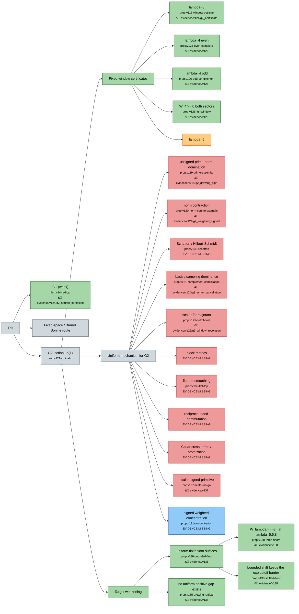

# Riemann project research map

_Generated from `research-map.json` — last updated 2026-09-21._
_Do not hand-edit: run `python3 tools/make_map.py`._

## Status

| status | count | meaning |
|---|---:|---|
| `proved` | 11 | established result |
| `live` | 1 | active candidate mechanism |
| `closed` | 10 | proved insufficient or impossible |
| `blocked` | 1 | attempted; obstruction found |
| `open` | 4 | target, not yet attacked |

## Nodes

- [ ] **RH** — via Weil positivity
  - [ ] **Fixed-space / Burnol Sonine route** — `lane/fixed-space` · needs evaluator estimates + closed-operator realization
  - [x] **G1 (weak)** — `thm:v14-radical` · `lane/g1` · evidence: [`evidence/v124/g2_source_certificate/`](evidence/v124/g2_source_certificate/) · closed for the repaired prolate source
  - [ ] **G2: cofinal -o(1)** — `prop:v121-cofinal-rh` · eps_lambda -> 0 cofinally IS RH
    - [x] **Fixed-window certificates** — `lane/window-scaling` · no finite list is cofinal
      - [x] **W_4 >= 0 both sectors** — `prop:v126-full-window` · evidence: [`evidence/v126/`](evidence/v126/) · only positive result; evidence restored and verified
      - [x] **lambda=3** — `prop:v116-window-positive` · evidence: [`evidence/v124/g2_certificate/`](evidence/v124/g2_certificate/)
      - [x] **lambda=4 even** — `prop:v125-even-complete` · `result/v125-even-complete` · evidence: [`evidence/v126/`](evidence/v126/)
      - [x] **lambda=4 odd** — `prop:v126-odd-complement` · `result/v126-odd-complement` · evidence: [`evidence/v126/`](evidence/v126/)
      - [!] **lambda=5** — 10^-8 D tail metric certified FALSE, both parities (v1.28)
    - [x] **Target weakening** — `lane/bounded-floor`
      - [x] **no uniform positive gap exists** — `prop:v135-growing-radical` · evidence: [`evidence/v135/`](evidence/v135/) · dense radical family; same fact as the floor reduction
      - [x] **uniform finite floor suffices** — `prop:v136-bounded-floor` · evidence: [`evidence/v136/`](evidence/v136/) · decay not required; dichotomy inf spec -> -inf or RH
        - [x] **W_lambda >= -8 I at lambda=5,6,8** — `prop:v138-three-floors` · `result/v138-three-floors` · evidence: [`evidence/v138/`](evidence/v138/) · both parities, full infinite tail, Z=0; margin 0.84 -> 0.10 (odd) as lambda grows; not cofinal
        - [x] **bounded shift keeps the exp cutoff barrier** — `prop:v138-shifted-floor` · evidence: [`evidence/v138/`](evidence/v138/) · N+1 > L exp(M_phi - delta); polynomial cutoff needs delta ~ M_phi
    - [ ] **Uniform mechanism for G2**
      - [X] **Cotlar cross terms / atomization** — `closed/cotlar-atomization` · **evidence missing** · v1.34, cross norm >= 73/(375 pi)
      - [X] **Schatten / Hilbert-Schmidt** — `prop:v132-schatten` · `closed/schatten` · **evidence missing**
      - [X] **basis / sampling dominance** — `prop:v121-complement-cancellation` · `closed/sampling-dominance` · evidence: [`evidence/v124/g2_schur_cancellation/`](evidence/v124/g2_schur_cancellation/)
      - [X] **block metrics** — `closed/block-metric` · **evidence missing** · v1.28, both parities
      - [X] **flat-top smoothing** — `prop:v132-flat-top` · `closed/flat-top` · **evidence missing**
      - [X] **norm contraction** — `prop:v120-norm-counterexample` · `closed/norm-contraction` · evidence: [`evidence/v124/g2_weighted_signed/`](evidence/v124/g2_weighted_signed/)
      - [X] **reciprocal-band commutation** — `closed/reciprocal-band` · **evidence missing** · v1.33, commutator norm > 9e-6
      - [X] **scalar far majorant** — `prop:v125-cutoff-cost` · `closed/scalar-far-majorant` · evidence: [`evidence/v126/g2_window_resolution/`](evidence/v126/g2_window_resolution/) · N ~ L exp(M_phi): exponential cutoff cost
      - [X] **scalar signed primitive** — `cor:v137-scalar-no-go` · `closed/scalar-primitive` · evidence: [`evidence/v137/`](evidence/v137/) · a Delta(beta_a) -> infinity, unconditional
      - [~] **signed weighted concentration** — `prop:v131-concentration` · `lane/concentration` · **evidence missing** · even sector; retains time-frequency correlations
      - [X] **unsigned prime-norm domination** — `prop:v119-prime-essential` · `closed/prime-norm` · evidence: [`evidence/v124/g2_growing_sign/`](evidence/v124/g2_growing_sign/) · norm ~ lambda, survives any finite removal

## Reading it

Each node is an idea. A node with children is a branch point: the
children are the sub-ideas tried from it. `closed` children are proved
dead ends and are kept deliberately — they are the project's main
output. `live` is the only node currently worth spending on.

Nodes marked with a folder icon are clickable in the diagram and link
to the `evidence/vNNN/` directory holding their certificates; the same
links appear in the list above.

