# Riemann project research map

_Generated from `research-map.json` — last updated 2026-09-21._
_Do not hand-edit: run `python3 tools/make_map.py`._

```mermaid
graph LR
  rh["RH"]
  g1["G1 (weak)<br/><small>thm:v14-radical</small><br/><small>&#128193; evidence/v124/g2_source_certificate</small>"]
  fixedspace["Fixed-space / Burnol Sonine route"]
  g2["G2: cofinal -o(1)<br/><small>prop:v121-cofinal-rh</small>"]
  windows["Fixed-window certificates"]
  w3["lambda=3<br/><small>prop:v116-window-positive</small><br/><small>&#128193; evidence/v124/g2_certificate</small>"]
  w4e["lambda=4 even<br/><small>prop:v125-even-complete</small><br/><small>&#128193; evidence/v126</small>"]
  w4o["lambda=4 odd<br/><small>prop:v126-odd-complement</small><br/><small>&#128193; evidence/v126</small>"]
  w4["W_4 >= 0 both sectors<br/><small>prop:v126-full-window</small><br/><small>&#128193; evidence/v126</small>"]
  w5["lambda=5"]
  uniform["Uniform mechanism for G2"]
  primenorm["unsigned prime-norm domination<br/><small>prop:v119-prime-essential</small><br/><small>&#128193; evidence/v124/g2_growing_sign</small>"]
  normcontr["norm contraction<br/><small>prop:v120-norm-counterexample</small><br/><small>&#128193; evidence/v124/g2_weighted_signed</small>"]
  schatten["Schatten / Hilbert-Schmidt<br/><small>prop:v132-schatten</small><br/><small>EVIDENCE MISSING</small>"]
  sampling["basis / sampling dominance<br/><small>prop:v121-complement-cancellation</small><br/><small>&#128193; evidence/v124/g2_schur_cancellation</small>"]
  farmaj["scalar far majorant<br/><small>prop:v125-cutoff-cost</small><br/><small>&#128193; evidence/v126/g2_window_resolution</small>"]
  blockmetric["block metrics<br/><small>EVIDENCE MISSING</small>"]
  flattop["flat-top smoothing<br/><small>prop:v132-flat-top</small><br/><small>EVIDENCE MISSING</small>"]
  recipband["reciprocal-band commutation<br/><small>EVIDENCE MISSING</small>"]
  cotlar["Cotlar cross terms / atomization<br/><small>EVIDENCE MISSING</small>"]
  scalarprim["scalar signed primitive<br/><small>cor:v137-scalar-no-go</small><br/><small>&#128193; evidence/v137</small>"]
  concentration["signed weighted concentration<br/><small>prop:v131-concentration</small><br/><small>EVIDENCE MISSING</small>"]
  weaken["Target weakening"]
  floor["uniform finite floor suffices<br/><small>prop:v136-bounded-floor</small><br/><small>&#128193; evidence/v136</small>"]
  gapfree["no uniform positive gap exists<br/><small>prop:v135-growing-radical</small><br/><small>&#128193; evidence/v135</small>"]
  floortest["W_lambda >= -8 I at lambda=5,6,8<br/><small>prop:v138-three-floors</small><br/><small>&#128193; evidence/v138</small>"]
  shiftbarrier["bounded shift keeps the exp cutoff barrier<br/><small>prop:v138-shifted-floor</small><br/><small>&#128193; evidence/v138</small>"]
  metablind["Scoped information-loss obstructions<br/><small>thm:v139-probe-relaxation; thm:v139-protected-orbit</small><br/><small>&#128193; evidence/v139</small>"]
  altroutes["Alternative criteria (all equivalent; same wall)"]
  circle["circle / Toeplitz-Hankel lens<br/><small>&#128193; evidence/diag_true_symbol</small>"]
  debranges["de Branges / Hermite-Biehler"]
  f1["function field / Hodge / F_1"]
  nb["Nyman-Beurling-Baez-Duarte<br/><small>&#128193; evidence/diag_routes/nb</small>"]
  li["Li / Keiper coefficients<br/><small>&#128193; evidence/diag_routes/li</small>"]
  dbn["de Bruijn-Newman (0 <= Lambda <= 0.22)<br/><small>&#128193; evidence/diag_routes/dbn</small>"]
  ccmmu["W_4 >= 0  <=>  CCM mu_lambda >= 0 for all lambda <= 4"]
  simpleeven4["complete W_4: simple even ground; real-zero transform<br/><small>prop:v140-ground4; cor:v140-real-zeros</small><br/><small>&#128193; evidence/v140</small>"]
  stepb["CCM step (b): finite-compression zeros track zeta zeros (numerical)<br/><small>&#128193; evidence/diag_ns2_semantic_lock</small>"]
  semanticlock["CCM finite-compression semantic lock, lambda=3 N=120<br/><small>lem:v141-centering; prop:v141-ccm-lock</small><br/><small>&#128193; evidence/v141</small>"]
  groundzero4["complete ground zero within 0.1 of gamma_1<br/><small>lem:v142-energy-projection; prop:v142-ground-zero</small><br/><small>&#128193; evidence/v142</small>"]
  groundzero4resolution["first complete zero within 9e-33; archived resolution quantified<br/><small>prop:v143-first-zero-bound; prop:v143-resolution; prop:v143-fixed-window-meaning</small><br/><small>&#128193; evidence/v143</small>"]
  pencilconcentration["pencil loss budget; cofinal obligation retained<br/><small>prop:v144-pencil-concentration</small><br/><small>&#128193; evidence/v144</small>"]

  rh --> g1
  rh --> fixedspace
  rh --> g2
  g2 --> windows
  windows --> w3
  windows --> w4e
  windows --> w4o
  windows --> w4
  windows --> w5
  g2 --> uniform
  uniform --> primenorm
  uniform --> normcontr
  uniform --> schatten
  uniform --> sampling
  uniform --> farmaj
  uniform --> blockmetric
  uniform --> flattop
  uniform --> recipband
  uniform --> cotlar
  uniform --> scalarprim
  uniform --> concentration
  g2 --> weaken
  weaken --> floor
  weaken --> gapfree
  floor --> floortest
  floor --> shiftbarrier
  uniform --> metablind
  rh --> altroutes
  altroutes --> circle
  altroutes --> debranges
  altroutes --> f1
  altroutes --> nb
  altroutes --> li
  altroutes --> dbn
  w4 --> ccmmu
  w4 --> simpleeven4
  simpleeven4 --> stepb
  windows --> semanticlock
  simpleeven4 --> groundzero4
  groundzero4 --> groundzero4resolution
  concentration --> pencilconcentration

  click g1 "https://github.com/AlexanderEastwood/riemann/tree/main/evidence/v124/g2_source_certificate/" "evidence: evidence/v124/g2_source_certificate" _blank
  click w3 "https://github.com/AlexanderEastwood/riemann/tree/main/evidence/v124/g2_certificate/" "evidence: evidence/v124/g2_certificate" _blank
  click w4e "https://github.com/AlexanderEastwood/riemann/tree/main/evidence/v126/" "evidence: evidence/v126" _blank
  click w4o "https://github.com/AlexanderEastwood/riemann/tree/main/evidence/v126/" "evidence: evidence/v126" _blank
  click w4 "https://github.com/AlexanderEastwood/riemann/tree/main/evidence/v126/" "evidence: evidence/v126" _blank
  click primenorm "https://github.com/AlexanderEastwood/riemann/tree/main/evidence/v124/g2_growing_sign/" "evidence: evidence/v124/g2_growing_sign" _blank
  click normcontr "https://github.com/AlexanderEastwood/riemann/tree/main/evidence/v124/g2_weighted_signed/" "evidence: evidence/v124/g2_weighted_signed" _blank
  click sampling "https://github.com/AlexanderEastwood/riemann/tree/main/evidence/v124/g2_schur_cancellation/" "evidence: evidence/v124/g2_schur_cancellation" _blank
  click farmaj "https://github.com/AlexanderEastwood/riemann/tree/main/evidence/v126/g2_window_resolution/" "evidence: evidence/v126/g2_window_resolution" _blank
  click scalarprim "https://github.com/AlexanderEastwood/riemann/tree/main/evidence/v137/" "evidence: evidence/v137" _blank
  click floor "https://github.com/AlexanderEastwood/riemann/tree/main/evidence/v136/" "evidence: evidence/v136" _blank
  click gapfree "https://github.com/AlexanderEastwood/riemann/tree/main/evidence/v135/" "evidence: evidence/v135" _blank
  click floortest "https://github.com/AlexanderEastwood/riemann/tree/main/evidence/v138/" "evidence: evidence/v138" _blank
  click shiftbarrier "https://github.com/AlexanderEastwood/riemann/tree/main/evidence/v138/" "evidence: evidence/v138" _blank
  click metablind "https://github.com/AlexanderEastwood/riemann/tree/main/evidence/v139/" "evidence: evidence/v139" _blank
  click circle "https://github.com/AlexanderEastwood/riemann/tree/main/evidence/diag_true_symbol/" "evidence: evidence/diag_true_symbol" _blank
  click nb "https://github.com/AlexanderEastwood/riemann/tree/main/evidence/diag_routes/nb/" "evidence: evidence/diag_routes/nb" _blank
  click li "https://github.com/AlexanderEastwood/riemann/tree/main/evidence/diag_routes/li/" "evidence: evidence/diag_routes/li" _blank
  click dbn "https://github.com/AlexanderEastwood/riemann/tree/main/evidence/diag_routes/dbn/" "evidence: evidence/diag_routes/dbn" _blank
  click simpleeven4 "https://github.com/AlexanderEastwood/riemann/tree/main/evidence/v140/" "evidence: evidence/v140" _blank
  click stepb "https://github.com/AlexanderEastwood/riemann/tree/main/evidence/diag_ns2_semantic_lock/" "evidence: evidence/diag_ns2_semantic_lock" _blank
  click semanticlock "https://github.com/AlexanderEastwood/riemann/tree/main/evidence/v141/" "evidence: evidence/v141" _blank
  click groundzero4 "https://github.com/AlexanderEastwood/riemann/tree/main/evidence/v142/" "evidence: evidence/v142" _blank
  click groundzero4resolution "https://github.com/AlexanderEastwood/riemann/tree/main/evidence/v143/" "evidence: evidence/v143" _blank
  click pencilconcentration "https://github.com/AlexanderEastwood/riemann/tree/main/evidence/v144/" "evidence: evidence/v144" _blank

  classDef proved fill:#a5d6a7,stroke:#1b5e20,stroke-width:1px,color:#000;
  class g1,windows,w3,w4e,w4o,w4,weaken,floor,gapfree,floortest,shiftbarrier,metablind,ccmmu,simpleeven4,semanticlock,groundzero4,groundzero4resolution,pencilconcentration proved;
  classDef live fill:#ffd54f,stroke:#f57f17,stroke-width:3px,color:#000;
  class circle,stepb live;
  classDef closed fill:#ef9a9a,stroke:#b71c1c,stroke-width:1px,color:#000;
  class primenorm,normcontr,schatten,sampling,farmaj,blockmetric,flattop,recipband,cotlar,scalarprim,debranges,f1,nb,li,dbn closed;
  classDef blocked fill:#ce93d8,stroke:#4a148c,stroke-width:1px,color:#000;
  class w5,concentration blocked;
  classDef open fill:#cfd8dc,stroke:#37474f,stroke-width:1px,color:#000;
  class rh,fixedspace,g2,uniform,altroutes open;
  subgraph Legend
    direction LR
    lg_live["current route (gold)"]:::live
    lg_closed["closed route"]:::closed
    lg_proved["proved"]:::proved
    lg_open["open"]:::open
    lg_blocked["blocked"]:::blocked
  end
```

## Status

| status | count | meaning |
|---|---:|---|
| `proved` | 18 | established result |
| `live` | 2 | current route (gold): being worked now |
| `closed` | 15 | closed route (red): proved insufficient or impossible; kept deliberately |
| `blocked` | 2 | attempted; obstruction found |
| `open` | 5 | target, not yet attacked |

## Nodes

- [ ] **RH** — via Weil positivity
  - [ ] **Alternative criteria (all equivalent; same wall)** — each is a known RH-equivalent criterion; none is closer; assessed 2026-09-21
    - [X] **Li / Keiper coefficients** — evidence: [`evidence/diag_routes/li/`](evidence/diag_routes/li/) · Li class ∩ Paley-Wiener = {0}: no window certifies any lambda_n; W_4>=0 gives windowed lambda_n^[log16] >= 0 only
    - [X] **Nyman-Beurling-Baez-Duarte** — evidence: [`evidence/diag_routes/nb/`](evidence/diag_routes/nb/) · no finite NB statement equivalent to W_lambda>=0; d_N certified to N=600, oscillates around C/log N; Burnol Thm 3.1 is the semantic lock
    - [~] **circle / Toeplitz-Hankel lens** — `lane/circle-toeplitz` · evidence: [`evidence/diag_true_symbol/`](evidence/diag_true_symbol/) · Validated symbol beta_a (2e-7 vs block). Ground level split: lambda=3 -/+0.0898, lambda=4 -/+0.2257, cancelling to 1e-38 / 1e-75; ~50% mass on {beta<0}; all energy at xi<20. In lattice units the symbol is a +/- train with crests on the lattice; the ground spreads outward in u with lambda; not self-similar. Level pencil W v = nu (W+W^-) v: the cancellation is a whole deep block (6/12/21/26 directions below 1e-8 at lambda=3/4/6/8, N=48), each cancelling 0.1-0.5 of level energy; not a single critical direction.
    - [X] **de Branges / Hermite-Biehler** — HB structure exists at every window after a shift; sign is the one scalar lambda_a; Krein-Langer determinacy = the wall (Suzuki 2606.09096, Conrey-Li)
    - [X] **de Bruijn-Newman (0 <= Lambda <= 0.22)** — evidence: [`evidence/diag_routes/dbn/`](evidence/diag_routes/dbn/) · no bridge either way (H_t has no Euler product / explicit formula); Lambda<=0 needs RH to all heights; Polymath15 barrier reproduced in 35s
    - [X] **function field / Hodge / F_1** — nothing finite transfers; window lambda has no intersection-theoretic meaning
  - [ ] **Fixed-space / Burnol Sonine route** — `lane/fixed-space` · needs evaluator estimates + closed-operator realization
  - [x] **G1 (weak)** — `thm:v14-radical` · `lane/g1` · evidence: [`evidence/v124/g2_source_certificate/`](evidence/v124/g2_source_certificate/) · closed for the repaired prolate source
  - [ ] **G2: cofinal -o(1)** — `prop:v121-cofinal-rh` · eps_lambda -> 0 cofinally IS RH
    - [x] **Fixed-window certificates** — `lane/window-scaling` · no finite list is cofinal
      - [x] **CCM finite-compression semantic lock, lambda=3 N=120** — `lem:v141-centering; prop:v141-ccm-lock` · evidence: [`evidence/v141/`](evidence/v141/) · Eight local root discrepancies reproduce CCM Figure 1 with 768/1024-bit interval gates. The zero benchmark cannot detect a common positive scale or identity shift. No new window, complete-ground transfer or cofinal statement.
      - [x] **W_4 >= 0 both sectors** — `prop:v126-full-window` · evidence: [`evidence/v126/`](evidence/v126/) · only positive result; evidence restored and verified
        - [x] **W_4 >= 0  <=>  CCM mu_lambda >= 0 for all lambda <= 4** — CCM arXiv:2511.22755 Cor 3.7-3.8 write 'we cannot assert mu_lambda >= 0'; monotone in lambda; positioning statement
        - [x] **complete W_4: simple even ground; real-zero transform** — `prop:v140-ground4; cor:v140-real-zeros` · `result/ns5-ground-state` · evidence: [`evidence/v140/`](evidence/v140/) · NS-5 complete: mu0<2.454e-75, mu1>1e-73, 1024/1280-bit shifted inertia; CvS Thm6.1 applies; no Xi convergence or G2 claim
          - [~] **CCM step (b): finite-compression zeros track zeta zeros (numerical)** — evidence: [`evidence/diag_ns2_semantic_lock/`](evidence/diag_ns2_semantic_lock/) · The 170-value CCM reproduction is a midpoint diagnostic, not a bound. Eight lambda=3, N=120 local roots are certified separately in v1.41. Original sinc-lattice inference withdrawn: missing centering phase in zeros.py. v1.42 separately encloses one complete lambda=4 zero within 0.1 of gamma_1. High-accuracy discrepancy transfer and cofinal Xi convergence remain open. v1.43 certifies a complete first-positive-zero radius 8.752082e-33 and quantifies the archived bound resolution; no complete discrepancy sign or 1e-71 magnitude.
          - [x] **complete ground zero within 0.1 of gamma_1** — `lem:v142-energy-projection; prop:v142-ground-zero` · `codex/complete-ground-zero-transfer` · evidence: [`evidence/v142/`](evidence/v142/) · 1024/1280-bit complete even separator 1e-67 plus energy projection; unique simple local zero, no earlier-zero ordering, discrepancy sign or cofinal claim.
            - [x] **first complete zero within 9e-33; archived resolution quantified** — `prop:v143-first-zero-bound; prop:v143-resolution; prop:v143-fixed-window-meaning` · `codex/complete-ground-zero-transfer` · evidence: [`evidence/v143/`](evidence/v143/) · NS-19: 1024/1280-bit evaluator bound and earlier-zero exclusion. A lower-energy transfer at 1e-71 needs rho-l about 3.2032e-153 plus a suitable trial center. No complete sign, universal resolution no-go or cofinal claim.
      - [x] **lambda=3** — `prop:v116-window-positive` · evidence: [`evidence/v124/g2_certificate/`](evidence/v124/g2_certificate/)
      - [x] **lambda=4 even** — `prop:v125-even-complete` · `result/v125-even-complete` · evidence: [`evidence/v126/`](evidence/v126/)
      - [x] **lambda=4 odd** — `prop:v126-odd-complement` · `result/v126-odd-complement` · evidence: [`evidence/v126/`](evidence/v126/)
      - [!] **lambda=5** — 10^-8 D tail metric certified FALSE, both parities (v1.28)
    - [x] **Target weakening** — `lane/bounded-floor`
      - [x] **no uniform positive gap exists** — `prop:v135-growing-radical` · evidence: [`evidence/v135/`](evidence/v135/) · dense radical family; same fact as the floor reduction
      - [x] **uniform finite floor suffices** — `prop:v136-bounded-floor` · evidence: [`evidence/v136/`](evidence/v136/) · decay not required; dichotomy inf spec -> -inf or RH
        - [x] **W_lambda >= -8 I at lambda=5,6,8** — `prop:v138-three-floors` · `result/v138-three-floors` · evidence: [`evidence/v138/`](evidence/v138/) · both parities, full infinite tail, Z=0; margin 0.84 -> 0.10 (odd) as lambda grows; not cofinal
        - [x] **bounded shift keeps the exp cutoff barrier** — `prop:v138-shifted-floor` · evidence: [`evidence/v138/`](evidence/v138/) · N+1 > L exp(M_phi - delta); polynomial cutoff needs delta ~ M_phi
    - [ ] **Uniform mechanism for G2**
      - [X] **Cotlar cross terms / atomization** — `closed/cotlar-atomization` · **evidence missing** · v1.34, cross norm >= 73/(375 pi)
      - [X] **Schatten / Hilbert-Schmidt** — `prop:v132-schatten` · `closed/schatten` · **evidence missing**
      - [x] **Scoped information-loss obstructions** — `thm:v139-probe-relaxation; thm:v139-protected-orbit` · `result/v139-meta-obstruction` · evidence: [`evidence/v139/`](evidence/v139/) · Full-histogram cap/probe relaxation fails; protected finite-head spectral orientation fails. Does not subsume all ten closures.
      - [X] **basis / sampling dominance** — `prop:v121-complement-cancellation` · `closed/sampling-dominance` · evidence: [`evidence/v124/g2_schur_cancellation/`](evidence/v124/g2_schur_cancellation/)
      - [X] **block metrics** — `closed/block-metric` · **evidence missing** · v1.28, both parities
      - [X] **flat-top smoothing** — `prop:v132-flat-top` · `closed/flat-top` · **evidence missing**
      - [X] **norm contraction** — `prop:v120-norm-counterexample` · `closed/norm-contraction` · evidence: [`evidence/v124/g2_weighted_signed/`](evidence/v124/g2_weighted_signed/)
      - [X] **reciprocal-band commutation** — `closed/reciprocal-band` · **evidence missing** · v1.33, commutator norm > 9e-6
      - [X] **scalar far majorant** — `prop:v125-cutoff-cost` · `closed/scalar-far-majorant` · evidence: [`evidence/v126/g2_window_resolution/`](evidence/v126/g2_window_resolution/) · N ~ L exp(M_phi): exponential cutoff cost
      - [X] **scalar signed primitive** — `cor:v137-scalar-no-go` · `closed/scalar-primitive` · evidence: [`evidence/v137/`](evidence/v137/) · a Delta(beta_a) -> infinity, unconditional
      - [!] **signed weighted concentration** — `prop:v131-concentration` · `lane/concentration` · **evidence missing** · Live mechanism of v1.31; v1.44 gives its exact pencil-coordinate demands. NS-22 (diag_comb_minorant, head N=256, float): every bounded-complexity step minorant loses a fixed fraction of D_a (layer-cake 0.35 D_a, one level set 0.6 D_a, J troughs 0.44-0.85 D_a); only a J-level quantization of beta_a with J ~ 1.2 D_a/eta keeps eta_a bounded, i.e. the level count grows without bound in a and the minorant then reproduces q_a itself. Obstruction found numerically; not a proved closure.
        - [x] **pencil loss budget; cofinal obligation retained** — `prop:v144-pencil-concentration` · `codex/complete-ground-zero-transfer` · evidence: [`evidence/v144/`](evidence/v144/) · NS-24 exact translation: relative loss <= nu_k + eta_a ||v_k||^2/q+. Source constraint and mixture cross terms retained. Diagnostic thresholds not certified; fixed-head tests do not replace cofinal full-complement control. No new concentration bound.
      - [X] **unsigned prime-norm domination** — `prop:v119-prime-essential` · `closed/prime-norm` · evidence: [`evidence/v124/g2_growing_sign/`](evidence/v124/g2_growing_sign/) · norm ~ lambda, survives any finite removal

## Reading it

Each node is an idea. A node with children is a branch point: the
children are the sub-ideas tried from it. `closed` children are proved
dead ends and are kept deliberately — they are the project's main
output. `live` is the only node currently worth spending on.

Nodes marked with a folder icon are clickable in the diagram and link
to the `evidence/vNNN/` directory holding their certificates; the same
links appear in the list above.

